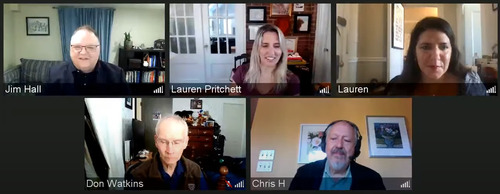

# Gaining experience in technical writing

Last year, I met with several technical writers for a virtual round table discussion about technical writing in all its forms. My panel included Lauren Maffeo (author), Lauren Pritchett (editor), and Don Watkins and Chris Hermansen (writers), all of whom shared their experience in technical writing. This was a very insightful conversation where we discussed several topics including:

- **How did you get started in technical writing?** Everyone has a different background and came into the field from different perspectives.

- **What writing tool or technology do you use?** We discussed a variety of methods for writing with digital technology, including Markdown, GitHub, and LibreOffice.

- **What advice would you give a new technical writer?** There's room for every topic and every perspective in technical writing. Write about what you know, and enjoy writing about it.

- **What's your writing process?** Some of us research a topic before writing about it, and others learn more about it as they go. Explain it like you're talking to a friend.

Our roundtable about technical writing

## Advice for new writers

Lauren Pritchett shared excellent advice to write about what you find interesting and don't worry if someone else has covered the topic too:

> Just because something has been written about before doesn't mean it doesn't deserve more attention. There's already a market out there for readers, so take advantage of that. And your opinion matters, you add value to the discussion, whether you're a beginner or advanced.

Lauren Maffeo had recently written a book and shared that her publisher uses GitHub and Markdown. As Lauren explained, "This is a workflow built around developers and technical folks." Technical writers using Markdown, GitHub, text editors, and other tools that application development teams use is quite common in organizations with in-house engineering. In fact, the process has a name: Docs as Code. This allows the technical writers to become more integrated with the engineering teams, which is not possible if the technical writer maintains a parallel yet separate workflow using Microsoft Word and shared drives.

## How to gain experience

There are many ways to gain experience in technical writing. One path with a low barrier to entry is writing about open source software. For example, you might write an article about any of these topics:

1. *Download an open source application and try it out.* You could write about 5 things you taught yourself about using LibreOffice over a weekend, or the process you followed to create a business card using Scribus.

2. *Experiment with a LiveCD version of a Linux distribution.* Many Linux distributions provide a LiveCD, so you don't actually have to install the system to use it. Boot a LiveCD and see what you can do, then write an article about 4 things you learned about using Fedora Linux, or what it was like using Ubuntu Linux as a first-time user.

3. *Write about a topic you learned about in a class.* For example, you might write an article about 6 cool things you learned to do with Markdown, or 4 things you learned about managing documentation in GitHub.

## Where to publish

Most websites that advertise an open community welcome new authors. If you aren't sure, check the website's banner or footer for a link about how to contact the editor. Websites that would gladly run articles about open source software include:

- [All Things Open](https://allthingsopen.org/articles) is an article website attached the All Things Open conference, but they run articles about any kind of open source. They especially like to publish how-to articles.
- [Both.org](https://www.both.org/) is an open community website that casts a wide net, including Linux, open source software, and programming. They publish daily and are always looking for new contributors.
- [Linux Journal](https://www.linuxjournal.com/) is the oldest magazine or website about the Linux operating system. They prefer to run only articles about Linux, such as first-time experiences with Linux.
- [Fedora Magazine](https://fedoramagazine.org/) is focused on the Fedora distribution of Linux. Articles should focus on what you can do with Fedora Linux. They are an open community, and they also welcome volunteer editors.
